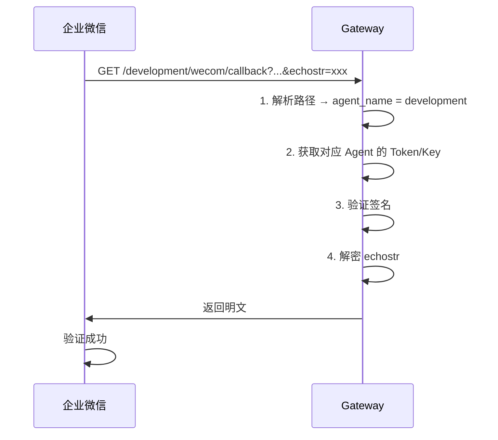
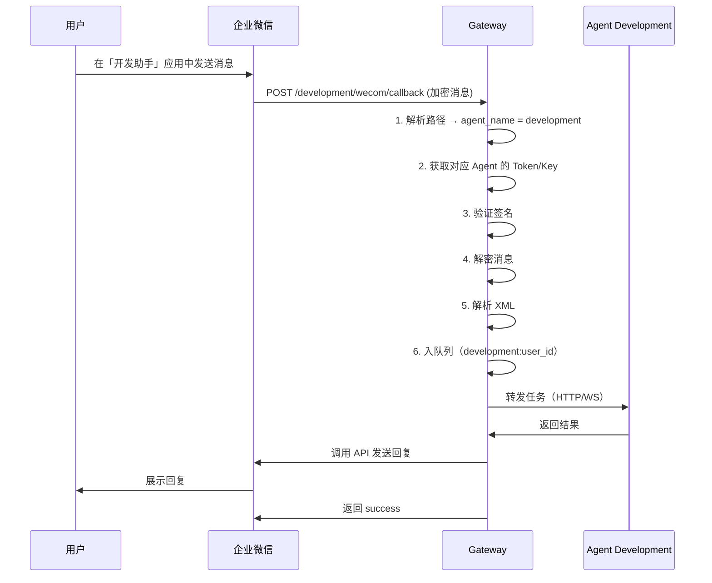

# OpenClaw 企业微信虚拟员工 - API 接口文档

## 📡 API 概览

本系统提供以下 API 接口：

| 接口 | 方法 | 路径 | 说明 |
|-----|------|------|------|
| 健康检查 | GET | `/health` | 服务健康状态 |
| 统计信息 | GET | `/stats` | 系统统计数据 |
| 企业微信回调（多 Agent）| GET/POST | `/{agent_name}/wecom/callback` | 企业微信消息回调（按 Agent 路由）|

**Base URL:** `http://YOUR_SERVER:8000`

**认证方式：** 
- 公开接口（health, stats）：无需认证
- 企业微信回调：企业微信签名验证（每个 Agent 独立 Token/Key）

**架构说明**：
- 取消了智能调度员（Dispatcher），改为基于 URL 路径的直接路由
- 每个 Agent 对应一个企业微信应用，有独立的 Token/EncodingAESKey
- 用户通过不同的企业微信应用访问对应的 Agent

---

## 1. 健康检查接口

### 接口信息

**请求：**
```http
GET /health
```

**响应：**
```json
{
  "status": "healthy",
  "timestamp": 1770792000,
  "enabled_agents": ["operation", "development"]
}
```

**字段说明：**
- `status`: 服务状态（healthy / unhealthy）
- `timestamp`: 当前时间戳（Unix时间，秒）
- `enabled_agents`: 已启用的 Agent 列表

---

### 示例

**cURL 请求：**
```bash
curl http://localhost:8000/health
```

**Python 请求：**
```python
import requests

response = requests.get('http://localhost:8000/health')
print(response.json())
```

**响应示例：**
```json
{
  "status": "healthy",
  "timestamp": 1770792000,
  "enabled_agents": ["operation", "product", "development", "testing", "service"]
}
```

---

### 状态码

| 状态码 | 说明 |
|-------|------|
| 200 | 服务正常 |
| 500 | 服务异常 |

---

## 2. 统计信息接口

### 接口信息

**请求：**
```http
GET /stats
```

**响应：**
```json
{
  "enabled_agents": 3,
  "total_agents": 5,
  "agents": {
    "operation": {"enabled": true, "port": 18791},
    "product": {"enabled": false, "port": 18792},
    "development": {"enabled": true, "port": 18793},
    "testing": {"enabled": true, "port": 18794},
    "service": {"enabled": false, "port": 18795}
  },
  "timestamp": 1770792000
}
```

**字段说明：**
- `enabled_agents`: 已启用的 Agent 数量
- `total_agents`: Agent 总数（固定为 5）
- `agents`: 各 Agent 的状态和配置
- `timestamp`: 当前时间戳

---

### 示例

**cURL 请求：**
```bash
curl http://localhost:8000/stats
```

**响应示例：**
```json
{
  "enabled_agents": 2,
  "total_agents": 5,
  "agents": {
    "operation": {"enabled": true, "port": 18791, "url": "http://172.20.0.11:18789"},
    "product": {"enabled": false, "port": 18792, "url": null},
    "development": {"enabled": true, "port": 18793, "url": "http://172.20.0.13:18789"},
    "testing": {"enabled": false, "port": 18794, "url": null},
    "service": {"enabled": false, "port": 18795, "url": null}
  },
  "timestamp": 1770792000
}
```

---

### 状态码

| 状态码 | 说明 |
|-------|------|
| 200 | 查询成功 |
| 500 | 服务器错误 |

---

## 3. 企业微信回调接口（多 Agent 路由）

### 3.1 URL 验证（GET）

**用途：** 企业微信首次配置时验证 URL 有效性

**请求：**
```http
GET /{agent_name}/wecom/callback?msg_signature=xxx&timestamp=xxx&nonce=xxx&echostr=xxx
```

**路径参数：**
- `agent_name`: Agent 名称（operation / product / development / testing / service）

**查询参数：**
- `msg_signature`: 消息签名（企业微信生成）
- `timestamp`: 时间戳
- `nonce`: 随机数
- `echostr`: 加密的随机字符串

**响应：**
- 返回解密后的 `echostr` 明文

---

### 路由示例

| Agent | 回调 URL 路径 | 企业微信应用 |
|-------|--------------|-------------|
| 运营专员 | `/operation/wecom/callback` | 运营助手应用 |
| 产品经理 | `/product/wecom/callback` | 产品助手应用 |
| 开发工程师 | `/development/wecom/callback` | 开发助手应用 |
| 测试工程师 | `/testing/wecom/callback` | 测试助手应用 |
| 客服专员 | `/service/wecom/callback` | 客服助手应用 |

---

### 验证流程



---

### 示例

**企业微信发送（运营助手应用）：**
```
GET /operation/wecom/callback?msg_signature=5c45ff5e21c57e6ad56bac8758b79b1d9ac89fd3&timestamp=1409659589&nonce=263014780&echostr=P9nAzCzyDtyTWESHep1vC5X9xho/qYX3Zpb4yKa9SKld1DsH3Iyt3tP3zNdtp+4RPcs8TgAE7OaBO+FZXvnl1Q==
```

**服务器响应：**
```
1616140317555161061
```

**企业微信发送（开发助手应用）：**
```
GET /development/wecom/callback?msg_signature=...&echostr=...
```

---

### 3.2 接收消息（POST）

**用途：** 接收企业微信用户发送的消息

**请求：**
```http
POST /{agent_name}/wecom/callback?msg_signature=xxx&timestamp=xxx&nonce=xxx
Content-Type: text/xml

<xml>
  <ToUserName><![CDATA[toUser]]></ToUserName>
  <AgentID><![CDATA[toAgentID]]></AgentID>
  <Encrypt><![CDATA[msg_encrypt]]></Encrypt>
</xml>
```

**路径参数：**
- `agent_name`: Agent 名称（operation / product / development / testing / service）

**查询参数：**
- `msg_signature`: 消息签名
- `timestamp`: 时间戳
- `nonce`: 随机数

**请求体字段：**
- `ToUserName`: 企业ID
- `AgentID`: 应用ID
- `Encrypt`: 加密的消息内容

---

### 消息处理流程



**关键变化**：
- 取消了 Dispatcher 的 AI 意图识别环节
- 直接根据 URL 路径（`/{agent_name}`）确定目标 Agent
- 消息队列 key 从 `user_id` 改为 `{agent_name}:{user_id}`（支持同一用户与多个 Agent 同时对话）

---

### 消息格式（解密后）

**文本消息：**
```xml
<xml>
  <ToUserName><![CDATA[ww1234567890abcdef]]></ToUserName>
  <FromUserName><![CDATA[zhangsan]]></FromUserName>
  <CreateTime>1409659813</CreateTime>
  <MsgType><![CDATA[text]]></MsgType>
  <Content><![CDATA[帮我写个测试用例]]></Content>
  <MsgId>1234567890123456</MsgId>
  <AgentID>1000002</AgentID>
</xml>
```

**字段说明：**
- `ToUserName`: 企业ID
- `FromUserName`: 发送者UserId
- `CreateTime`: 创建时间戳
- `MsgType`: 消息类型（text/image/voice/video/file/link/...）
- `Content`: 消息内容
- `MsgId`: 消息ID
- `AgentID`: 应用ID

---

### 响应

**成功响应：**
```
success
```

**失败响应：**
```
error: <错误信息>
```

---

### 状态码

| 状态码 | 说明 |
|-------|------|
| 200 | 处理成功 |
| 400 | 请求参数错误 |
| 403 | 签名验证失败 |
| 404 | Agent 不存在或未启用 |
| 500 | 服务器错误 |

---

## 4. 配置管理（环境变量）

### Agent 配置格式

每个 Agent 需要在 `.env` 文件中独立配置：

```bash
# 运营专员配置
AGENT_OPERATION_ENABLE=true                           # 是否启用
AGENT_OPERATION_WECOM_TOKEN=your_operation_token      # 企业微信 Token
AGENT_OPERATION_WECOM_ENCODING_AES_KEY=your_key       # 企业微信 EncodingAESKey
AGENT_OPERATION_PORT=18791                            # 容器端口映射
AGENT_OPERATION_URL=http://172.20.0.11:18789          # Agent 内部 URL（生产环境用 Docker IP）

# 产品经理配置
AGENT_PRODUCT_ENABLE=false
# ... 类似配置

# 开发工程师配置
AGENT_DEVELOPMENT_ENABLE=true
AGENT_DEVELOPMENT_WECOM_TOKEN=your_development_token
AGENT_DEVELOPMENT_WECOM_ENCODING_AES_KEY=your_dev_key
AGENT_DEVELOPMENT_PORT=18793
AGENT_DEVELOPMENT_URL=http://172.20.0.13:18789

# 测试工程师、客服专员 类似...
```

### 配置说明

| 配置项 | 必填 | 说明 | 示例 |
|-------|------|------|------|
| `AGENT_{ROLE}_ENABLE` | 是 | 是否启用该 Agent | true / false |
| `AGENT_{ROLE}_WECOM_TOKEN` | 是（启用时）| 企业微信 Token | 32位字符串 |
| `AGENT_{ROLE}_WECOM_ENCODING_AES_KEY` | 是（启用时）| 企业微信 EncodingAESKey | Base64 编码，43字符 |
| `AGENT_{ROLE}_PORT` | 否 | 容器端口映射（本地） | 18791-18795 |
| `AGENT_{ROLE}_URL` | 是（启用时）| Agent 内部 URL | http://localhost:18791（本地）<br>http://172.20.0.11:18789（生产）|

**注意**：
- 每个 Agent 对应一个企业微信应用，Token/Key 不能重复
- 只有 `ENABLE=true` 的 Agent 会被启动
- URL 在本地环境用 `localhost:PORT`，生产环境用 Docker 固定 IP

---

## 5. 内部 API（Agent 通信）

### 5.1 调用 Agent（HTTP）

**请求：**
```http
POST http://{agent_url}/
Content-Type: application/json
Authorization: Bearer {OPENCLAW_INTERNAL_TOKEN}

{
  "message": "用户消息内容",
  "session_key": "{agent_name}:{user_id}",
  "user_id": "zhangsan"
}
```

**响应：**
```json
{
  "reply": "Agent 的回复内容"
}
```

---

### 5.2 调用 Agent（WebSocket，默认）

**连接：**
```
ws://{agent_url}/ws
```

**发送消息：**
```json
{
  "message": "用户消息内容",
  "session_key": "{agent_name}:{user_id}",
  "user_id": "zhangsan"
}
```

**接收流式响应：**
```json
{"delta": "正"}
{"delta": "在"}
{"delta": "处理"}
{"delta": "..."}
```

---

## 6. 企业微信 API 调用

### 6.1 获取 Access Token

**接口：** `https://qyapi.weixin.qq.com/cgi-bin/gettoken`

**方法：** GET

**参数：**
- `corpid`: 企业ID
- `corpsecret`: 应用Secret

**响应：**
```json
{
  "errcode": 0,
  "errmsg": "ok",
  "access_token": "ACCESS_TOKEN",
  "expires_in": 7200
}
```

**注意**：在多 Agent 模式下，Gateway 不再需要 Access Token（改为使用智能机器人模式，不主动发送消息）

---

### 6.2 发送应用消息（可选）

**接口：** `https://qyapi.weixin.qq.com/cgi-bin/message/send`

**方法：** POST

**参数：** `?access_token=ACCESS_TOKEN`

**请求体：**
```json
{
  "touser": "UserID1|UserID2|UserID3",
  "msgtype": "text",
  "agentid": 1000002,
  "text": {
    "content": "你的快递已到，请携带工卡前往邮件中心领取。"
  }
}
```

**响应：**
```json
{
  "errcode": 0,
  "errmsg": "ok",
  "msgid": "xxxx"
}
```

---

## 7. 错误码

### 7.1 HTTP 状态码

| 状态码 | 说明 |
|-------|------|
| 200 | 请求成功 |
| 400 | 请求参数错误 |
| 401 | 未授权 |
| 403 | 禁止访问（签名验证失败） |
| 404 | 接口不存在 / Agent 未启用 |
| 500 | 服务器内部错误 |
| 503 | 服务不可用 |

---

### 7.2 业务错误码

| 错误码 | 说明 | 解决方案 |
|-------|------|---------|
| AGENT_NOT_ENABLED | Agent 未启用 | 在 .env 中设置 `AGENT_{ROLE}_ENABLE=true` |
| AGENT_NOT_FOUND | Agent 不存在 | 检查 URL 路径中的 agent_name |
| INVALID_SIGNATURE | 签名验证失败 | 检查 Token 配置是否正确 |
| DECRYPT_ERROR | 解密失败 | 检查 EncodingAESKey 配置 |
| QUEUE_FULL | 消息队列已满 | 等待或增加队列大小 |

---

### 7.3 企业微信错误码

| errcode | errmsg | 说明 |
|---------|--------|------|
| 0 | ok | 成功 |
| 40001 | invalid credential | access_token 无效 |
| 40003 | invalid openid | openid 无效 |
| 40013 | invalid appid | appid 无效 |
| 40014 | invalid access_token | access_token 无效 |
| 41001 | access_token missing | 缺少 access_token |
| 42001 | access_token expired | access_token 超时 |
| 43004 | require subscribe | 需要接收者关注 |
| 44002 | empty post data | POST 数据为空 |
| 45009 | reach max api daily quota limit | 超过每日调用次数限制 |

完整错误码见：https://developer.work.weixin.qq.com/document/path/90313

---

## 8. 数据库表结构

### 8.1 消息队列表 (message_queue)

```sql
CREATE TABLE message_queue (
    id INTEGER PRIMARY KEY AUTOINCREMENT,
    queue_key TEXT UNIQUE NOT NULL,     -- 队列键：{agent_name}:{user_id}
    message TEXT NOT NULL,              -- 消息内容
    created_at TIMESTAMP DEFAULT CURRENT_TIMESTAMP,
    status TEXT DEFAULT 'pending'       -- pending / processing / completed
);
```

**示例数据：**
```
id | queue_key              | message          | status
---+------------------------+------------------+----------
1  | development:zhangsan   | 帮我写测试用例    | pending
2  | operation:lisi         | 分析数据          | processing
```

**索引：**
```sql
CREATE INDEX idx_queue_key ON message_queue(queue_key);
CREATE INDEX idx_status ON message_queue(status);
```

---

### 8.2 会话表 (sessions)

```sql
CREATE TABLE sessions (
    session_key TEXT PRIMARY KEY,       -- 会话键：{agent_name}:{user_id}
    user_id TEXT NOT NULL,              -- 用户ID
    agent_name TEXT NOT NULL,           -- Agent 名称
    last_activity TIMESTAMP DEFAULT CURRENT_TIMESTAMP,
    context TEXT                        -- 会话上下文（JSON）
);
```

**示例数据：**
```
session_key            | user_id  | agent_name  | last_activity
-----------------------+----------+-------------+-------------------
development:zhangsan   | zhangsan | development | 2026-03-02 10:00:00
operation:lisi         | lisi     | operation   | 2026-03-02 10:05:00
```

---

## 9. 安全机制

### 9.1 签名验证

**算法：** SHA1

**验证步骤：**
1. 将 Token、Timestamp、Nonce 三个参数按字典序排序
2. 拼接成一个字符串
3. 进行 SHA1 哈希
4. 与 msg_signature 对比

**代码示例：**
```python
import hashlib

def verify_signature(signature, timestamp, nonce, token):
    params = sorted([token, timestamp, nonce])
    s = ''.join(params)
    computed_signature = hashlib.sha1(s.encode('utf-8')).hexdigest()
    return computed_signature == signature
```

**多 Agent 模式下的变化**：
- 每个 Agent 使用独立的 Token
- Gateway 根据 URL 路径获取对应 Agent 的 Token 进行验证

---

### 9.2 消息加解密

**算法：** AES-256-CBC

**密钥：** EncodingAESKey（Base64解码后32字节）

**填充：** PKCS7

**解密流程：**
1. Base64 解码密文
2. AES-256-CBC 解密
3. 去除填充
4. 提取明文（去掉前16字节随机数和最后的企业ID）

**代码示例：**
```python
from Crypto.Cipher import AES
import base64

def decrypt(encrypt_msg, aes_key):
    cipher = AES.new(aes_key, AES.MODE_CBC, aes_key[:16])
    decrypted = cipher.decrypt(base64.b64decode(encrypt_msg))
    # 去除填充和提取明文...
    return plaintext
```

**多 Agent 模式下的变化**：
- 每个 Agent 使用独立的 EncodingAESKey
- Gateway 根据 URL 路径获取对应 Agent 的 Key 进行解密

---

## 10. 测试示例

### 10.1 健康检查测试

```bash
#!/bin/bash
# test_health.sh

echo "测试健康检查接口..."
response=$(curl -s http://localhost:8000/health)
status=$(echo $response | jq -r '.status')

if [ "$status" == "healthy" ]; then
    echo "✅ 健康检查通过"
    echo "已启用的 Agent: $(echo $response | jq -r '.enabled_agents')"
else
    echo "❌ 健康检查失败: $response"
fi
```

---

### 10.2 测试多 Agent 路由

```bash
#!/bin/bash
# test_agent_routing.sh

# 测试运营专员路由
echo "测试运营专员..."
curl "http://localhost:8000/operation/wecom/callback?msg_signature=xxx&timestamp=xxx&nonce=xxx&echostr=xxx"

# 测试开发工程师路由
echo "测试开发工程师..."
curl "http://localhost:8000/development/wecom/callback?msg_signature=xxx&timestamp=xxx&nonce=xxx&echostr=xxx"

# 测试未启用的 Agent
echo "测试未启用的产品经理..."
curl "http://localhost:8000/product/wecom/callback?msg_signature=xxx&timestamp=xxx&nonce=xxx&echostr=xxx"
# 预期返回 404 或错误信息
```

---

### 10.3 并发测试

```python
#!/usr/bin/env python3
# test_concurrent.py

import requests
import concurrent.futures
import time

def send_message(agent_name, user_id, content):
    url = f"http://localhost:8000/test/send"
    data = {
        "agent_name": agent_name,
        "user_id": user_id,
        "content": content
    }
    response = requests.post(url, json=data)
    return response.json()

# 测试多用户同时与不同 Agent 对话
agents = ["operation", "development", "testing"]
users = [f"user{i}" for i in range(10)]

with concurrent.futures.ThreadPoolExecutor(max_workers=10) as executor:
    futures = []
    for agent in agents:
        for user in users:
            future = executor.submit(
                send_message,
                agent,
                user,
                f"测试消息 from {user} to {agent}"
            )
            futures.append(future)
    
    for future in concurrent.futures.as_completed(futures):
        print(future.result())
```

---

## 附录

### A. 相关文档

- [企业微信 API 文档](https://developer.work.weixin.qq.com/)
- [消息推送接入文档](https://developer.work.weixin.qq.com/document/path/90930)
- [应用消息发送文档](https://developer.work.weixin.qq.com/document/path/90236)

---

### B. 工具推荐

- **API 测试：** Postman, cURL, HTTPie
- **签名验证：** 企业微信开发者工具
- **数据库查看：** DB Browser for SQLite
- **日志分析：** tail, grep, awk

---

### C. 架构变更记录

**V1.4 (2026-03-02) - 多 Agent 独立配置模式**

**主要变化**：
1. **去除 Dispatcher 调度员**：不再使用 AI 意图识别进行路由
2. **URL 路径路由**：通过 `/{agent_name}/wecom/callback` 直接路由到对应 Agent
3. **每个 Agent 独立配置**：独立的企业微信 Token/Key，对应不同的企业微信应用
4. **消息队列键变更**：从 `user_id` 改为 `{agent_name}:{user_id}`，支持同一用户与多个 Agent 同时对话
5. **按需启用/禁用**：通过 `.env` 文件的 `AGENT_{ROLE}_ENABLE` 控制

**迁移指南**：
- 原单一企业微信应用 → 每个 Agent 创建独立应用
- 原回调 URL `/wecom/callback` → 改为 `/{agent_name}/wecom/callback`
- 原环境变量 `WECOM_TOKEN` → 改为 `AGENT_{ROLE}_WECOM_TOKEN`

---

**文档版本：** v2.0 (架构升级版)  
**更新时间：** 2026-03-02  
**适用版本：** OpenClaw 企业微信 v1.4+
