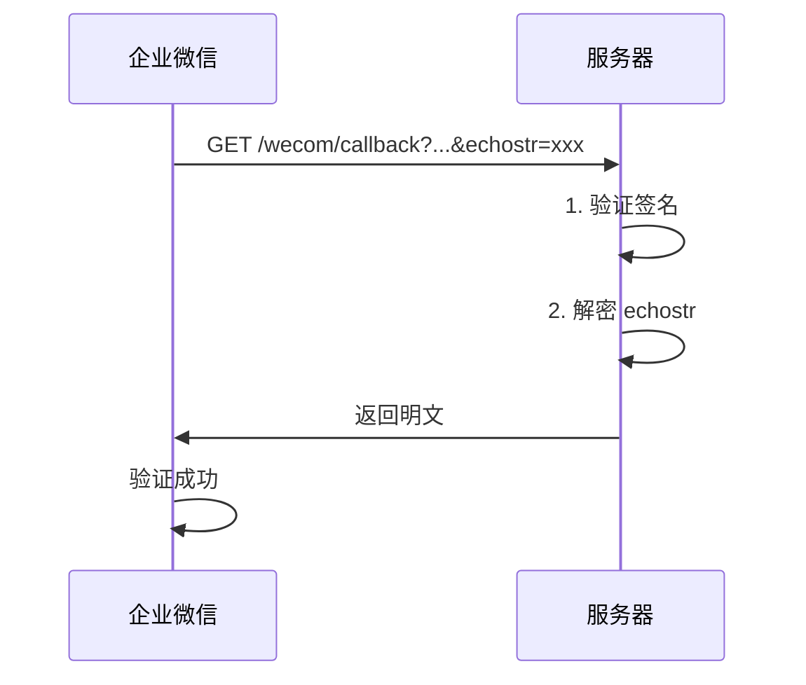
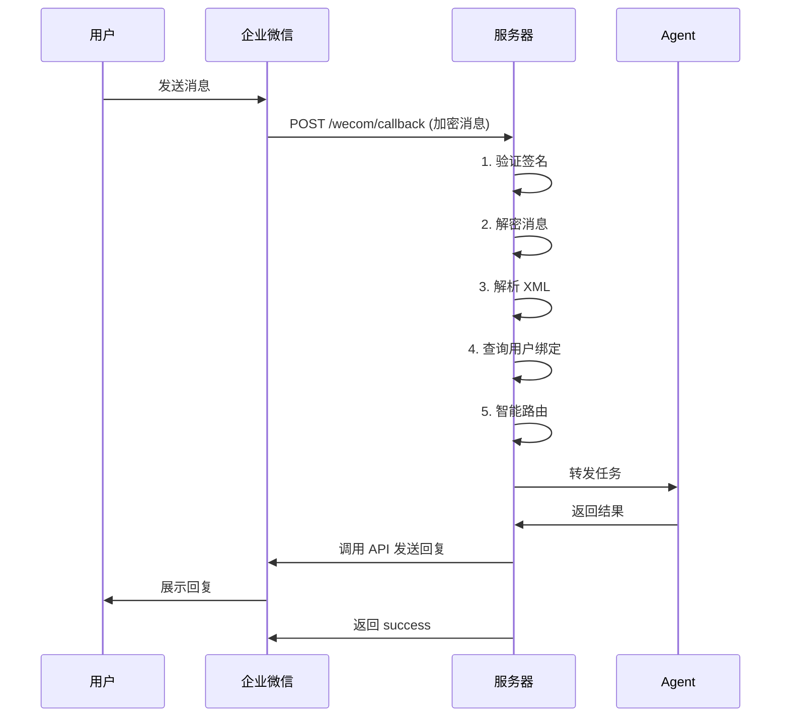

# OpenClaw 企业微信虚拟员工 - API 接口文档

## 📡 API 概览

本系统提供以下 API 接口：

| 接口 | 方法 | 路径 | 说明 |
|-----|------|------|------|
| 健康检查 | GET | `/health` | 服务健康状态 |
| 统计信息 | GET | `/stats` | 系统统计数据 |
| 企业微信回调 | GET/POST | `/wecom/callback` | 企业微信消息回调 |

**Base URL:** `http://YOUR_SERVER:8080`

**认证方式：** 
- 公开接口（health, stats）：无需认证
- 企业微信回调：企业微信签名验证

---

## 1. 健康检查接口

### 接口信息

**请求：**
```http
GET /health
```

**响应：**
```json
{
  "status": "healthy",
  "timestamp": 1770792000
}
```

**字段说明：**
- `status`: 服务状态（healthy / unhealthy）
- `timestamp`: 当前时间戳（Unix时间，秒）

---

### 示例

**cURL 请求：**
```bash
curl http://localhost:8080/health
```

**Python 请求：**
```python
import requests

response = requests.get('http://localhost:8080/health')
print(response.json())
```

**响应示例：**
```json
{
  "status": "healthy",
  "timestamp": 1770792000
}
```

---

### 状态码

| 状态码 | 说明 |
|-------|------|
| 200 | 服务正常 |
| 500 | 服务异常 |

---

## 2. 统计信息接口

### 接口信息

**请求：**
```http
GET /stats
```

**响应：**
```json
{
  "users": 5,
  "today_tasks": 12,
  "total_tasks": 156,
  "timestamp": 1770792000
}
```

**字段说明：**
- `users`: 注册用户总数
- `today_tasks`: 今日任务数
- `total_tasks`: 累计任务数
- `timestamp`: 当前时间戳

---

### 示例

**cURL 请求：**
```bash
curl http://localhost:8080/stats
```

**响应示例：**
```json
{
  "users": 5,
  "today_tasks": 12,
  "total_tasks": 156,
  "timestamp": 1770792000
}
```

---

### 状态码

| 状态码 | 说明 |
|-------|------|
| 200 | 查询成功 |
| 500 | 服务器错误 |

---

## 3. 企业微信回调接口

### 3.1 URL 验证（GET）

**用途：** 企业微信首次配置时验证 URL 有效性

**请求：**
```http
GET /wecom/callback?msg_signature=xxx&timestamp=xxx&nonce=xxx&echostr=xxx
```

**参数说明：**
- `msg_signature`: 消息签名（企业微信生成）
- `timestamp`: 时间戳
- `nonce`: 随机数
- `echostr`: 加密的随机字符串

**响应：**
- 返回解密后的 `echostr` 明文

---

### 验证流程



---

### 示例

**企业微信发送：**
```
GET /wecom/callback?msg_signature=5c45ff5e21c57e6ad56bac8758b79b1d9ac8
9fd3&timestamp=1409659589&nonce=263014780&echostr=P9nAzCzyDtyTWESHep
1vC5X9xho/qYX3Zpb4yKa9SKld1DsH3Iyt3tP3zNdtp+4RPcs8TgAE7OaBO+FZXvnl1Q==
```

**服务器响应：**
```
1616140317555161061
```

---

### 3.2 接收消息（POST）

**用途：** 接收企业微信用户发送的消息

**请求：**
```http
POST /wecom/callback?msg_signature=xxx&timestamp=xxx&nonce=xxx
Content-Type: text/xml

<xml>
  <ToUserName><![CDATA[toUser]]></ToUserName>
  <AgentID><![CDATA[toAgentID]]></AgentID>
  <Encrypt><![CDATA[msg_encrypt]]></Encrypt>
</xml>
```

**参数说明：**
- `msg_signature`: 消息签名
- `timestamp`: 时间戳
- `nonce`: 随机数

**请求体字段：**
- `ToUserName`: 企业ID
- `AgentID`: 应用ID
- `Encrypt`: 加密的消息内容

---

### 消息处理流程



---

### 消息格式（解密后）

**文本消息：**
```xml
<xml>
  <ToUserName><![CDATA[ww1234567890abcdef]]></ToUserName>
  <FromUserName><![CDATA[zhangsan]]></FromUserName>
  <CreateTime>1409659813</CreateTime>
  <MsgType><![CDATA[text]]></MsgType>
  <Content><![CDATA[客服，用户反馈登录问题]]></Content>
  <MsgId>1234567890123456</MsgId>
  <AgentID>1000002</AgentID>
</xml>
```

**字段说明：**
- `ToUserName`: 企业ID
- `FromUserName`: 发送者UserId
- `CreateTime`: 创建时间戳
- `MsgType`: 消息类型（text/image/voice/video/file/link/...）
- `Content`: 消息内容
- `MsgId`: 消息ID
- `AgentID`: 应用ID

---

### 响应

**成功响应：**
```
success
```

**失败响应：**
```
error: <错误信息>
```

---

### 状态码

| 状态码 | 说明 |
|-------|------|
| 200 | 处理成功 |
| 400 | 请求参数错误 |
| 403 | 签名验证失败 |
| 500 | 服务器错误 |

---

## 4. 内部 API（未对外开放）

### 4.1 获取 Access Token

**内部函数：** `get_access_token()`

**用途：** 调用企业微信 API 需要的访问令牌

**实现：**
```python
def get_access_token():
    url = f"https://qyapi.weixin.qq.com/cgi-bin/gettoken"
    params = {
        'corpid': CORP_ID,
        'corpsecret': SECRET
    }
    response = requests.get(url, params=params)
    data = response.json()
    return data.get('access_token')
```

**缓存策略：**
- 令牌有效期：7200秒（2小时）
- 建议缓存策略：提前5分钟刷新

---

### 4.2 发送文本消息

**内部函数：** `send_text_message(user_id, content)`

**用途：** 主动向用户发送文本消息

**实现：**
```python
def send_text_message(user_id, content):
    access_token = get_access_token()
    url = f"https://qyapi.weixin.qq.com/cgi-bin/message/send?access_token={access_token}"
    
    data = {
        "touser": user_id,
        "msgtype": "text",
        "agentid": AGENT_ID,
        "text": {
            "content": content
        }
    }
    
    response = requests.post(url, json=data)
    return response.json()
```

**参数：**
- `user_id`: 接收者的企业微信UserId
- `content`: 消息内容（支持换行符 `\n`）

**返回：**
```json
{
  "errcode": 0,
  "errmsg": "ok",
  "msgid": "xxx"
}
```

---

### 4.3 智能路由

**内部函数：** `route_message(content, user_roles)`

**用途：** 根据消息内容和用户绑定关系，决定路由目标

**关键词匹配规则：**

| 角色 | 关键词 | 优先级 |
|-----|--------|--------|
| service-agent | 客服、咨询、投诉、售后、帮助 | 95 |
| development-agent | bug、开发、代码、部署、接口 | 85 |
| operation-agent | 活动、推广、文案、数据、用户 | 80 |
| testing-agent | 测试、用例、验收、回归、自动化 | 75 |
| product-agent | 需求、功能、原型、设计、迭代 | 70 |

**匹配逻辑：**
1. 遍历关键词列表
2. 检查消息内容是否包含关键词
3. 检查用户是否绑定该角色
4. 按优先级返回第一个匹配的角色
5. 无匹配时返回第一个绑定的角色

---

## 5. 企业微信 API 调用

### 5.1 获取 Access Token

**接口：** `https://qyapi.weixin.qq.com/cgi-bin/gettoken`

**方法：** GET

**参数：**
- `corpid`: 企业ID
- `corpsecret`: 应用Secret

**响应：**
```json
{
  "errcode": 0,
  "errmsg": "ok",
  "access_token": "ACCESS_TOKEN",
  "expires_in": 7200
}
```

---

### 5.2 发送应用消息

**接口：** `https://qyapi.weixin.qq.com/cgi-bin/message/send`

**方法：** POST

**参数：** `?access_token=ACCESS_TOKEN`

**请求体：**
```json
{
  "touser": "UserID1|UserID2|UserID3",
  "toparty": "PartyID1|PartyID2",
  "totag": "TagID1|TagID2",
  "msgtype": "text",
  "agentid": 1000002,
  "text": {
    "content": "你的快递已到，请携带工卡前往邮件中心领取。\n出发前可查看<a href=\"http://work.weixin.qq.com\">邮件中心视频实况</a>，聪明避开排队。"
  },
  "safe": 0,
  "enable_id_trans": 0,
  "enable_duplicate_check": 0,
  "duplicate_check_interval": 1800
}
```

**字段说明：**
- `touser`: 接收者用户ID（多个用|分隔）
- `toparty`: 接收者部门ID
- `totag`: 接收者标签ID
- `msgtype`: 消息类型（text/image/voice/video/file/...）
- `agentid`: 应用ID
- `safe`: 是否是保密消息（0=否，1=是）

**响应：**
```json
{
  "errcode": 0,
  "errmsg": "ok",
  "msgid": "xxxx",
  "response_code": "response_code"
}
```

---

## 6. 错误码

### 6.1 HTTP 状态码

| 状态码 | 说明 |
|-------|------|
| 200 | 请求成功 |
| 400 | 请求参数错误 |
| 401 | 未授权 |
| 403 | 禁止访问（签名验证失败） |
| 404 | 接口不存在 |
| 500 | 服务器内部错误 |
| 503 | 服务不可用 |

---

### 6.2 企业微信错误码

| errcode | errmsg | 说明 |
|---------|--------|------|
| 0 | ok | 成功 |
| 40001 | invalid credential | access_token 无效 |
| 40003 | invalid openid | openid 无效 |
| 40013 | invalid appid | appid 无效 |
| 40014 | invalid access_token | access_token 无效 |
| 41001 | access_token missing | 缺少 access_token |
| 42001 | access_token expired | access_token 超时 |
| 43004 | require subscribe | 需要接收者关注 |
| 44002 | empty post data | POST 数据为空 |
| 45009 | reach max api daily quota limit | 超过每日调用次数限制 |

完整错误码见：https://developer.work.weixin.qq.com/document/path/90313

---

## 7. 数据库表结构

### 7.1 用户角色表 (user_roles)

```sql
CREATE TABLE user_roles (
    user_id TEXT PRIMARY KEY,          -- 企业微信 UserId
    roles TEXT,                        -- 绑定的角色（逗号分隔）
    created_at TIMESTAMP DEFAULT CURRENT_TIMESTAMP,
    updated_at TIMESTAMP DEFAULT CURRENT_TIMESTAMP
);
```

**示例数据：**
```
user_id       | roles
--------------+---------------------------------------
zhangsan      | service-agent,operation-agent
lisi          | development-agent,testing-agent
```

---

### 7.2 任务日志表 (task_logs)

```sql
CREATE TABLE task_logs (
    id INTEGER PRIMARY KEY AUTOINCREMENT,
    task_id TEXT UNIQUE,               -- 任务唯一ID
    user_id TEXT,                      -- 用户ID
    agent_id TEXT,                     -- 路由到的Agent
    task_content TEXT,                 -- 任务内容
    status TEXT,                       -- 状态（success/failure）
    result TEXT,                       -- 执行结果
    created_at TIMESTAMP DEFAULT CURRENT_TIMESTAMP
);
```

**示例数据：**
```
id | task_id        | user_id  | agent_id          | task_content | status  | created_at
---+----------------+----------+-------------------+--------------+---------+-------------------
1  | task-abc123    | zhangsan | operation-agent   | 写活动文案    | success | 2026-02-11 10:00:00
2  | task-def456    | lisi     | development-agent | 修复bug      | success | 2026-02-11 10:05:00
```

---

### 7.3 审计日志表 (audit_logs)

```sql
CREATE TABLE audit_logs (
    id INTEGER PRIMARY KEY AUTOINCREMENT,
    event_type TEXT,                   -- 事件类型
    user_id TEXT,                      -- 操作用户
    details TEXT,                      -- 详细信息
    created_at TIMESTAMP DEFAULT CURRENT_TIMESTAMP
);
```

---

## 8. 安全机制

### 8.1 签名验证

**算法：** SHA1

**验证步骤：**
1. 将 Token、Timestamp、Nonce 三个参数按字典序排序
2. 拼接成一个字符串
3. 进行 SHA1 哈希
4. 与 msg_signature 对比

**代码示例：**
```python
import hashlib

def verify_signature(signature, timestamp, nonce, token):
    params = sorted([token, timestamp, nonce])
    s = ''.join(params)
    computed_signature = hashlib.sha1(s.encode('utf-8')).hexdigest()
    return computed_signature == signature
```

---

### 8.2 消息加解密

**算法：** AES-256-CBC

**密钥：** EncodingAESKey（Base64解码后32字节）

**填充：** PKCS7

**解密流程：**
1. Base64 解码密文
2. AES-256-CBC 解密
3. 去除填充
4. 提取明文（去掉前16字节随机数和最后的企业ID）

**代码示例：**
```python
from Crypto.Cipher import AES
import base64

def decrypt(encrypt_msg, aes_key):
    cipher = AES.new(aes_key, AES.MODE_CBC, aes_key[:16])
    decrypted = cipher.decrypt(base64.b64decode(encrypt_msg))
    # 去除填充和提取明文...
    return plaintext
```

---

## 9. 监控指标

### 9.1 性能指标

| 指标 | 端点 | 说明 |
|-----|------|------|
| 响应时间 | /health | P50/P95/P99 延迟 |
| 吞吐量 | /wecom/callback | 每秒请求数 (QPS) |
| 成功率 | /wecom/callback | 成功请求 / 总请求 |

---

### 9.2 业务指标

| 指标 | 数据源 | 说明 |
|-----|--------|------|
| 用户数 | user_roles 表 | 注册用户总数 |
| 任务数 | task_logs 表 | 处理任务总数 |
| 路由成功率 | task_logs 表 | status=success 占比 |
| Agent 使用分布 | task_logs 表 | 各 Agent 处理量 |

---

## 10. 测试示例

### 10.1 健康检查测试

```bash
#!/bin/bash
# test_health.sh

echo "测试健康检查接口..."
response=$(curl -s http://localhost:8080/health)
status=$(echo $response | jq -r '.status')

if [ "$status" == "healthy" ]; then
    echo "✅ 健康检查通过"
else
    echo "❌ 健康检查失败: $response"
fi
```

---

### 10.2 模拟企业微信回调

```bash
#!/bin/bash
# test_wecom_callback.sh

# 模拟 GET 验证
curl "http://localhost:8080/wecom/callback?msg_signature=xxx&timestamp=1234567890&nonce=123456&echostr=encrypted_string"

# 模拟 POST 消息
curl -X POST "http://localhost:8080/wecom/callback?msg_signature=xxx&timestamp=1234567890&nonce=123456" \
  -H "Content-Type: text/xml" \
  -d '<xml><Encrypt><![CDATA[encrypted_message]]></Encrypt></xml>'
```

---

## 附录

### A. 相关文档

- [企业微信 API 文档](https://developer.work.weixin.qq.com/)
- [消息推送接入文档](https://developer.work.weixin.qq.com/document/path/90930)
- [应用消息发送文档](https://developer.work.weixin.qq.com/document/path/90236)

---

### B. 工具推荐

- **API 测试：** Postman, cURL
- **签名验证：** 企业微信开发者工具
- **数据库查看：** DB Browser for SQLite
- **日志分析：** Kibana, Grafana

---

**文档版本：** v1.0  
**更新时间：** 2026-02-11  
**适用版本：** OpenClaw 企业微信 v1.0+
